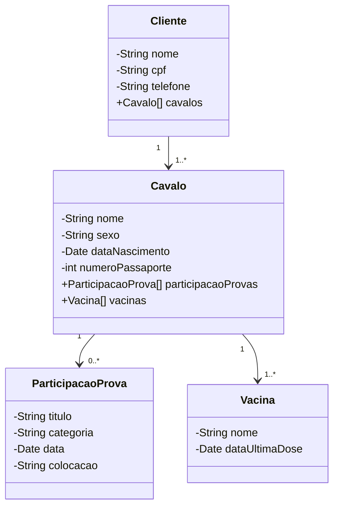

# Cuiabá Equestrian Team

```mermaid
classDiagram
    class Cliente {
        -String nome
        -String cpf
        -String telefone
        +Cavalo[] cavalos
    }
    
    class Cavalo {
        -String nome
        -String sexo
        -Date dataNascimento
        -int numeroPassaporte
        +ParticipacaoProva[] participacaoProvas
        +Vacina[] vacinas
    }
    
    class ParticipacaoProva {
        -String titulo
        -String categoria
        -Date data
        -String colocacao
    }
    
    class Vacina {
        -String nome
        -Date dataUltimaDose
    }
    
    Cliente "1" --> "1..*" Cavalo
    Cavalo "1" --> "0..*" ParticipacaoProva
    Cavalo "1" --> "1..*" Vacina
```
